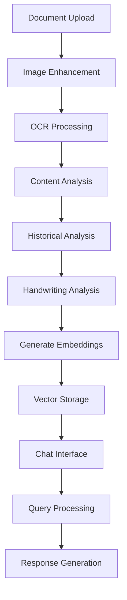

# Handwriting & Historical Document Analysis Agent V1

🏛️ **Enterprise-grade AI-powered analysis of handwritten documents, historical texts, and manuscripts**

## Overview

The Handwriting & Historical Document Analysis Agent is a sophisticated AI system designed to process, analyze, and enable interactive chat with historical documents, manuscripts, and handwritten texts. Built with cutting-edge OCR models, LangGraph workflows, and RAG capabilities.

## Key Features

### 📜 Document Processing
- **Advanced OCR**: Microsoft TrOCR models for handwritten and printed text
- **Multi-format Support**: Images (PNG, JPG, TIFF), PDFs, and text files
- **Image Enhancement**: Automatic deskewing, denoising, and quality improvement
- **Layout Analysis**: Document structure and element detection

### 🤖 AI Analysis
- **Handwriting Recognition**: Specialized models for historical handwriting
- **Historical Context**: Time period detection and historical significance analysis
- **Content Analysis**: Automatic metadata extraction and content categorization
- **Quality Assessment**: Confidence scoring and readability analysis

### 🔍 Interactive Features
- **Document Chat**: RAG-powered conversational interface with your documents
- **Vector Search**: Semantic search through processed document content
- **Multi-document Analysis**: Batch processing and cross-document insights
- **Real-time Processing**: Live workflow monitoring and results

### 🎯 Enterprise Ready
- **LangGraph Orchestration**: Robust workflow management and state tracking
- **Observability**: Langfuse integration for monitoring and analytics
- **Scalable Architecture**: Async processing and efficient resource usage
- **Free Models First**: HuggingFace models as primary option with optional paid APIs

## Installation

### Prerequisites
- Python 3.9+
- Git
- Optional: Tesseract OCR (for additional OCR capabilities)

### Quick Setup

```bash
# Clone the repository
git clone <repository-url>
cd training-agentic-ai/agents/handwriting-document-agent

# Create virtual environment
python -m venv venv
source venv/bin/activate  # On Windows: venv\Scripts\activate

# Install dependencies
pip install -r requirements.txt

# Set up environment variables
cp .env.example .env
# Edit .env with your API keys (HuggingFace recommended, others optional)
```

### Environment Configuration

Create a `.env` file with the following variables:

```bash
# Required: HuggingFace for free models
HUGGINGFACE_API_KEY=hf_your_key_here

# Optional: Enhanced analysis capabilities
OPENAI_API_KEY=sk-your-key-here
ANTHROPIC_API_KEY=sk-ant-your-key-here
GOOGLE_API_KEY=AIza-your-key-here

# Optional: Observability (recommended for production)
LANGFUSE_PUBLIC_KEY=pk-lf-your-key-here
LANGFUSE_SECRET_KEY=sk-lf-your-key-here
LANGFUSE_HOST=https://cloud.langfuse.com
```

## Usage

### Starting the Application

```bash
# Activate virtual environment
source venv/bin/activate

# Run the Streamlit application
streamlit run app.py
```

The application will be available at `http://localhost:8501`

### Basic Workflow

1. **Upload Documents**: Support for images, PDFs, and text files
2. **Configure Processing**: Choose analysis depth and enhancement options
3. **Process Documents**: AI-powered OCR and analysis pipeline
4. **Review Results**: Detailed analysis with confidence scores and metadata
5. **Interactive Chat**: Ask questions about your documents using natural language

### Document Types Supported

- **Handwritten Manuscripts**: Historical handwriting recognition
- **Printed Historical Documents**: OCR optimized for historical fonts
- **Mixed Documents**: Combined handwritten and printed text
- **Modern Documents**: Contemporary handwriting and text
- **Multi-page PDFs**: Automatic page splitting and batch processing

## Architecture

### Core Components

```
handwriting-document-agent/
├── config.py              # Configuration and settings
├── app.py                 # Main Streamlit application
├── models/                # AI models and processing
│   └── document_models.py # HuggingFace model integration
├── processors/            # Document processing pipeline
│   └── document_processor.py # OCR and image enhancement
├── graph/                 # LangGraph workflows
│   └── document_workflow.py  # Workflow orchestration
├── rag/                   # RAG system for document chat
│   └── document_rag.py    # Vector storage and retrieval
├── data/                  # Data storage (created at runtime)
└── outputs/               # Processing outputs
```

### Workflow Architecture



## Model Configuration

### HuggingFace Models (Free, Primary)

- **OCR Models**: Microsoft TrOCR for handwritten and printed text
- **Layout Models**: LayoutLMv3 for document structure
- **Embedding Models**: Sentence Transformers for semantic search
- **Specialized Models**: Historical document processing models

### Optional Enhanced Models

- **OpenAI**: GPT models for advanced analysis
- **Anthropic**: Claude for complex reasoning
- **Google**: Gemini for multimodal understanding

## API Reference

### Core Classes

#### DocumentWorkflowManager
```python
from graph.document_workflow import DocumentWorkflowManager

workflow = DocumentWorkflowManager()
result = await workflow.process_document(
    document_path="path/to/document.jpg",
    document_type="handwritten",
    user_query="What is this document about?",
    analysis_options={
        "include_handwriting_analysis": True,
        "include_historical_context": True,
        "analysis_depth": "comprehensive"
    }
)
```

#### DocumentRAGSystem
```python
from rag.document_rag import DocumentRAGSystem

rag = DocumentRAGSystem()
await rag.index_documents(processed_documents)

response = await rag.chat_with_documents(
    query="Who is mentioned in this document?",
    top_k=5
)
```

### Configuration Options

```python
# Processing options
processing_options = ProcessingOptions(
    enhance_image=True,      # Image quality enhancement
    deskew=True,            # Automatic rotation correction
    denoise=True,           # Noise reduction
    auto_rotate=True,       # Orientation correction
    ocr_language="eng",     # OCR language
    confidence_threshold=0.7 # Minimum confidence for results
)

# Analysis options
analysis_options = {
    "include_metadata_extraction": True,
    "include_handwriting_analysis": True,
    "include_historical_context": True,
    "analysis_depth": "comprehensive"  # quick|standard|comprehensive
}
```

## Performance Optimization

### Recommended Settings

- **Concurrent Processing**: Limited to 3 documents simultaneously
- **Image Resolution**: 300 DPI for optimal OCR results
- **Chunk Size**: 1000 characters for RAG processing
- **Vector Dimensions**: 384 (sentence-transformers default)

### Memory Usage

- **Base Memory**: ~2GB for core models
- **Per Document**: ~50-100MB during processing
- **Vector Storage**: ~1KB per text chunk

## Troubleshooting

### Common Issues

1. **Model Loading Errors**
   - Ensure HuggingFace API key is set
   - Check internet connection for model downloads
   - Verify disk space for model caching

2. **OCR Quality Issues**
   - Enable image enhancement options
   - Try different document type settings
   - Ensure good image quality (300+ DPI)

3. **Memory Issues**
   - Process fewer documents simultaneously
   - Reduce image resolution if needed
   - Monitor system memory usage

### Performance Tips

- Use SSD storage for faster model loading
- Enable GPU acceleration if available (CUDA)
- Process documents in smaller batches
- Clear cache periodically in production

## Development

### Adding New Models

```python
# In models/document_models.py
def _load_custom_model(self):
    self.custom_model = AutoModel.from_pretrained("your-model-name")
    self.models["custom"] = self.custom_model
```

### Extending Analysis

```python
# In graph/document_workflow.py
async def custom_analysis_step(self, state: DocumentState) -> DocumentState:
    # Your custom analysis logic
    state["custom_analysis"] = await self._run_custom_analysis(state["extracted_text"])
    return state
```

## Contributing

We welcome contributions! Please see our contributing guidelines:

1. Fork the repository
2. Create a feature branch
3. Add tests for new functionality
4. Ensure all tests pass
5. Submit a pull request

## License

This project is licensed under the MIT License - see the LICENSE file for details.

## Support

For support and questions:

- 📧 Email: support@example.com
- 💬 Discord: Join our community
- 📖 Documentation: Full docs available online
- 🐛 Issues: GitHub Issues for bug reports

## Roadmap

### Upcoming Features

- [ ] Advanced handwriting style analysis
- [ ] Multi-language OCR support
- [ ] Document comparison and diff analysis
- [ ] Export to various formats (DOCX, PDF, TEI)
- [ ] Collaborative annotation features
- [ ] API endpoints for integration

### Model Enhancements

- [ ] Fine-tuned models for specific historical periods
- [ ] Improved historical context detection
- [ ] Better handwriting quality assessment
- [ ] Enhanced layout analysis capabilities

---

**Author**: Mohammed Hamdan  
**Version**: 1.0.0  
**Last Updated**: November 2024

Built with ❤️ using HuggingFace, LangGraph, and Streamlit